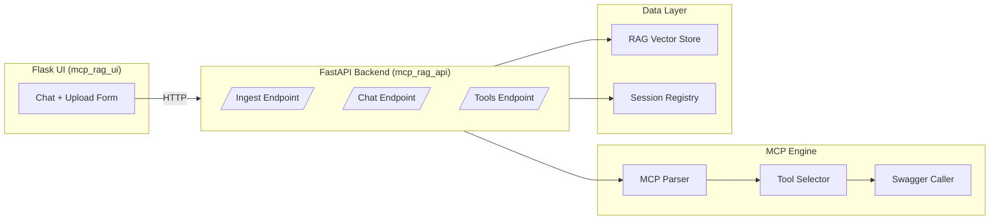

# 🧠 MCP-RAG Swagger Chat

A **proof-of-concept AI agent** that turns any **Swagger/OpenAPI specification** into an interactive **chat assistant**.  
Users can upload one or more Swagger URLs, and the system automatically converts the API definitions into **MCP (Model Context Protocol) tools** that the AI can reason about and call dynamically — all enhanced with **RAG (Retrieval-Augmented Generation)** for context memory.

---

## 🚀 Overview

This project demonstrates how an AI can:
1. Ingest any **public Swagger or OpenAPI** specification (v1/v2/v3).
2. Convert endpoints into **function tools** usable by OpenAI models.
3. Maintain **contextual memory** through a RAG vector store.
4. Expose a **Flask web UI** to chat naturally with the API.
5. Run everything locally in **Docker**.

### Example Flow
```bash
1️⃣ User provides:
   Swagger URL → "https://petstore.swagger.io/v2/swagger.json"
   Instructions → "You are an API assistant for pets."

2️⃣ Backend builds:
   → MCP Tool Registry (one per endpoint)
   → RAG Context Store

3️⃣ User chats:
   "Create a dog named Snowball."
   → AI selects POST /pet
   → Sends API call
   → Returns live API response.
```

---

## 🧩 Architecture



### Components

| File | Purpose |
|------|----------|
| **app/main.py** | FastAPI endpoints (`/ingest`, `/chat`, `/tools`) |
| **app/mcp.py** | Parses Swagger/OpenAPI into MCP-compliant tool schemas |
| **app/providers.py** | Executes API calls dynamically from tool definitions |
| **app/tool_select.py** | Ranks and filters tools for relevance and intent |
| **app/registry.py** | Session management + chat history |
| **app/rag_store.py** | Simple in-memory RAG storage |
| **ui/app.py** | Flask web interface for chatting |
| **docker-compose.yml** | Multi-container setup (FastAPI + Flask) |
| **.env.example** | Environment configuration template |

---

## ⚙️ How It Works

### 1. Ingestion
- User posts one or more Swagger URLs to `/ingest`.
- Backend fetches each spec and converts it into MCP tool objects.
- Tool definitions and endpoint descriptions are embedded into the RAG store.
- The system learns the domain vocabulary dynamically.

### 2. Chat
- Each user message is enriched with retrieved context from RAG.
- AI ranks the available tools using semantic and intent heuristics.
- Only the top N tools are exposed to the model (see `TOP_TOOL_LIMIT`).
- If the model selects a tool call, it’s executed in real time.
- Results are streamed back to the chat UI.

### 3. MCP + Swagger Integration
- Converts OpenAPI/Swagger operations into callable JSON schemas.
- Expands `{param}` placeholders automatically in URLs.
- Ignores file-upload or multipart endpoints unless explicitly requested.
- Normalizes arguments to match OpenAI function-calling expectations.

---

## 🧰 Environment Variables

| Variable | Description | Default |
|-----------|--------------|----------|
| `OPENAI_API_KEY` | Your OpenAI API key | — |
| `TOP_TOOL_LIMIT` | How many tools to expose per chat turn | `8` |
| `RAG_TOP_K` | Number of contextual docs retrieved | `5` |
| `ALLOW_FILE_PARAMS` | Allow Swagger endpoints with `file` params | `0` |
| `AVOID_UPLOAD_BY_DEFAULT` | Skip upload/image endpoints unless explicitly asked | `1` |

---

## 🐳 Running with Docker

```bash
# 1. Clone repository
git clone https://github.com/yourusername/mcp-rag-swagger-chat.git
cd mcp-rag-swagger-chat

# 2. Copy and configure environment
cp .env.example .env
nano .env

# 3. Build and start services
docker compose up --build
```

Then open:
- **Flask UI:** http://localhost:5000  
- **FastAPI API Docs:** http://localhost:8000/docs  

---

## 💬 Example Interaction

**User:**  
> “Add a new dog named Snowball that’s available.”

**AI (internally):**
- Ranks endpoints (`POST /pet` highest).
- Calls:
  ```json
  {
    "name": "Snowball",
    "status": "available",
    "category": {"name": "dog"}
  }
  ```
- Executes real API request → Returns API response.

**Result:**  
✅ “Snowball (dog) has been successfully added and marked as available.”

---

## 🧠 Notes & Limitations

- Designed for **public Swagger/OpenAPI URLs** only.
- File-upload endpoints are skipped unless `ALLOW_FILE_PARAMS=1`.
- Currently stateless per session (`sess`); can be extended with Redis.
- Works best with GPT-4o-mini or GPT-4-Turbo for function-calling.
- Not intended for private data or sensitive APIs.

---

## 📈 Roadmap

- [ ] Persistent RAG store with Chroma or Redis.
- [ ] Multi-user session isolation.
- [ ] Streaming responses to UI.
- [ ] Auto-parameter synthesis from API schemas.
- [ ] Swagger authentication header injection.
- [ ] Cloud-deployable template.

---

## 🧩 Credits

Built with:
- **FastAPI**  
- **Flask**  
- **OpenAI API**  
- **Docker Compose**  
- **MCP (Model Context Protocol)**  

Designed as an open, modular playground for building **AI-API fusion systems**.
